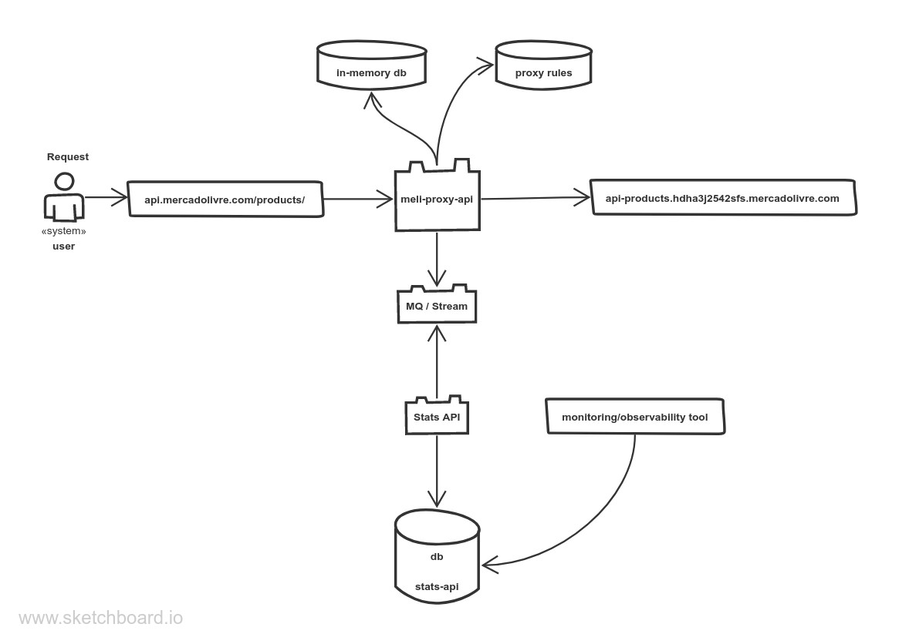
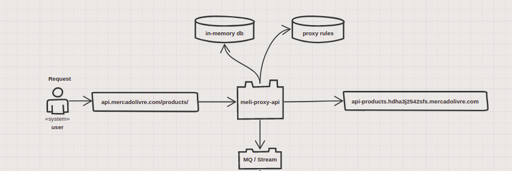
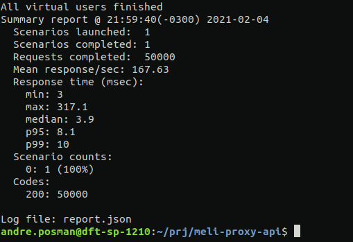

# **meli-proxy-api**

 

### Running the Project
The API is running on Docker/docker-compose so you can run the following commands to start-up the project: 
- **`make u`**  equals to `docker-compose up`  

- **`make d`**  equals to `docker-compose down`  

- **`make l`**  equals to `docker-compose logs`  

- **`make r`**  equals to `docker-compose down && docker-compose up --build && docker-compose logs -f`  

- **`make db`** equals to `docker-compose up redis`

- **`make mq`** equals to `docker-compose up broker`

I am also sharing the Postman collection that I created for the project, below:
 

If you want to run just the tests, open three terminals and do the following:
- **`make db`** equals to `docker-compose up redis`
- **`make mq`** equals to `docker-compose up broker`

- **`npm test`**

---

### **Challenge Requirements**
>Implementar um "proxy de apis" com os seguintes requisitos (em ordem de importância):
>   
> ● Executar a função de proxy sobre o domínio api.mercadolibre.com, isto é, ele
> deve agir como um intermediário para as requisições dos clientes, enviando-as à
> api.mercadolibre.com.
> 
> ● Deverá permitir o controle das quantidades máximas de requisições por:
>     ○ IP de origem
>     ○ Path de destino
>     ○ Combinações de ambos
>     ○ Outros critérios ou alternativas de controle são bem vindos ;)
>     
> ● Deve armazenar (e também permitir que se consulte) as estatísticas de uso do
> proxy.
> 
> ● O proxy (como solução) deverá poder superar 50.000 requisições por segundo.
> Não faremos testes de carga, mas avaliaremos se a arquitetura utilizada é escalável o suficiente.
> 
> Alguns desejáveis:
>     ● A interface para estatísticas e controle deveria prover APIs Rest.
>     ● Um desenho simples de arquitetura da solução e  documentação (README) conta muito
---

### **Solution**

### **Architecture** 

I drew up this solution after some thinking and researching. I tried to follow the most that I could of the 12 Factors and also trying to make the solution the most scalable as I could think of, maintaining performance since the proxy should sustain 50k requests. 
        

 

### **Stack/Technologies Used**
 * Docker/docker-compose
 * JavaScript
 * Express
 * Kafka
 * Redis
 * Jest
 * Supertest
 * Artillery
 * Other packages like: dotenv, http-graceful-shutdown, express-healthcheck, helmet, http-status-codes, morgan, jsend, redis-mock, moment, nodemon

 

### **Problems, Decisions and Points of Improvements**
 

As I soon found out, the architecture solution designed by me was complex for me due to time, job, and knowledge constraints, but I decided that I should deliver the most possible in the seven days, even though Javi told me that I could ask for more time.

Because of that, I could only deliver a part of the solution. I didn't have time to build the stats-API that would persist the user's data for a monitory tool to consume from the database. The image below is what I could actually build

 

 

    
 Summarized version of the decisions and problems that I faced in developing the solution above.

I believe that I complicated and over-engineered the tools and solutions in relation to the actual time that I had fully dedicated to building the application. I would have been better making it more simple and with doing so having time to build that rest of the systems and divulge time to refine and improve my code 

 

   
    
 *This the looong version.*

The first of many roadblocks was the language used to develop this application. 
My first thought was to write in Golang because of performance, but I was afraid that I would not be able to develop the core of the functionalities in time for the deadline since I had a lot more to learn. I opted for Javascript/Node because I'm more proficient in it and would less of an obstacle compared to Golang, but if you have the time, here is a personal project still in development written by me in Golang: https://github.com/andreposman/magic-number

My next problem was to choose what MQ to use between RabbitMQ, Kafka, or even Redis with a Pub/Sub (that I didn't know was possible). After some research, I choose Kafka as my MQ/Streaming Service because of its scalability, high-performance, and high-throughput. But in hindsight, it was a bit of an overkill and over-engineering, which I should have avoided since it was my first time implementing an MQ. If I could start again, I would have chosen Redis or RabbitMQ. 
I lost a lot of time trying to configure and make Kafka work properly. I am certain that even though it works, a more experienced developer would have done a better job handling the connections, I/O operations, and especially the configuration on docker/docker-compose. 

Regarding the in-memory solution, my first idea was to use the application itself to manipulate the data, but that would not be a good idea because if the application crashed, I would lose all of the data, and it would be complicated to scale if needed also, it would be making my app stateful which would infringe one of the 12 Factors, that says the application should be stateless.
So I ended up choosing Redis, but I believe the same problems that I mentioned above with Kafka could apply here since was also my first time using it, the rate-limit/proxy logic that I used has more get/set operations that are needed, but it was the only way that I was able to make it work and meet the requirements.

 

### Tests

I left testing for last in the application development-cycle so with the time that had remaining I did only unit testing, but I would have liked to do e2e and some integration tests like setting/getting keys and values from Redis, producing/consuming from Kafka, and the rate limit feature.

Even though it was not necessary I was curious about how my application would handle some load testing, so I used artillery and left running for some minuts. This is the result:

